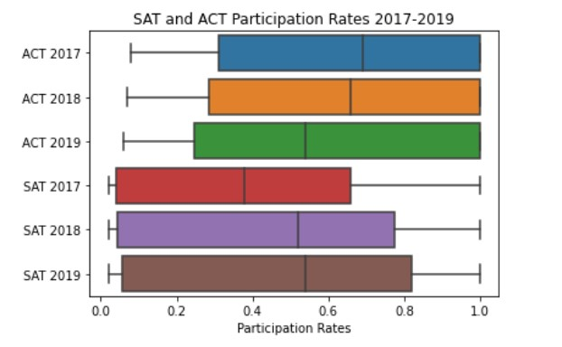

#  Project 1: Standardized Test Analysis

## Problem Statement
The SAT and ACT are standardized tests used for college admissions in the United States. This project aims to explore trends in SAT and ACT scores and participation for the years 2017-2019 and make recommendations to College Board to improve the participation rates of SAT.

### Contents:
- [Background](#Background)
- [Data Import & Cleaning](#Data-Import-&-Cleaning)
- [Data Analysis & Visualization](#Data-Analysis-&-Visualization)
- [Summary and Recommendations](#Summary-and-Recommendations)

## Background

The SAT and ACT are standardized tests that many colleges and universities in the United States require for their admissions process. This score is used along with other materials such as grade point average (GPA) and essay responses to determine whether or not a potential student will be accepted to the university.

The SAT has two sections of the test: Evidence-Based Reading and Writing and Math ([*source*](https://www.princetonreview.com/college/sat-sections)). The ACT has 4 sections: English, Mathematics, Reading, and Science, with an additional optional writing section ([*source*](https://www.act.org/content/act/en/products-and-services/the-act/scores/understanding-your-scores.html)). They have different score ranges, which you can read more about on their websites or additional outside sources (a quick Google search will help you understand the scores for each test):
* [SAT](https://collegereadiness.collegeboard.org/sat)
* [ACT](https://www.act.org/content/act/en.html)

Standardized tests have long been a controversial topic for students, administrators, and legislators. Since the 1940's, an increasing number of colleges have been using scores from sudents' performances on tests like the SAT and the ACT as a measure for college readiness and aptitude ([*source*](https://www.minotdailynews.com/news/local-news/2017/04/a-brief-history-of-the-sat-and-act/)). Supporters of these tests argue that these scores can be used as an objective measure to determine college admittance. Opponents of these tests claim that these tests are not accurate measures of students potential or ability and serve as an inequitable barrier to entry.

The new format for the SAT was released in March 2016. Since then, levels of participation in multiple states have changed with varying legislative decisions. At the same time, College Board has also partnered Khan Academy to provide free SAT preparation, which led to an increase in SAT test-takers ([*source*](https://newsroom.collegeboard.org/college-board-announces-surge-students-taking-new-satr-suite-assessments-creating-opportunity)). In 2019, SAT has took over ACT as the more popular test. More than 2.2 million students in the class of 2019 took the SAT ([*source*](https://newsroom.collegeboard.org/over-22-million-students-class-2019-took-sat-largest-group-ever#:~:text=Over%202.2%20Million%20Students%20in,Group%20Ever%20%7C%20The%20College%20Board)), as compared to 1.8 million students who took the ACT ([*source*](https://www.act.org/content/dam/act/unsecured/documents/National-CCCR-2019.pdf)). Some companies have been reported to ask job candidates for their SAT scores, which could be used as a differentiator among other candidates ([*source*](https://www.wsj.com/articles/SB10001424052702303636404579395220334268350)). 

## Data-Import-&-Cleaning

The following datasets will be used for this analysis:
* [`act_2017.csv`](./data/act_2017.csv): 2017 ACT Scores by State
* [`act_2018.csv`](./data/act_2018.csv): 2018 ACT Scores by State
* [`act_2019.csv`](./data/act_2019.csv): 2019 ACT Scores by State
* [`sat_2017.csv`](./data/sat_2017.csv): 2017 SAT Scores by State
* [`sat_2018.csv`](./data/sat_2018.csv): 2018 SAT Scores by State
* [`sat_2019.csv`](./data/sat_2019.csv): 2019 SAT Scores by State

These datasets were imported and cleaned, and subsequently merged into a dataframe called merged_df. Refer to data dictionary below:

|Feature|Type|Dataset|Description|
|---|---|---|---|
|**state**|*object*|merged_df|Names of US States and DC| 
|**part_act_2017**|*float*|merged_df|Participation rate of students that took the ACT in 2017.| 
|**comp_act_2017**|*float*|merged_df|ACT 2017 composite score, calculated as the average of English, Math, Reading, Science scores| 
|**part_act_2018**|*float*|merged_df|Participation rate of students that took the ACT in 2018.| 
|**comp_act_2018**|*float*|merged_df|ACT 2018 composite score, calculated as the average of English, Math, Reading, Science scores| 
|**part_act_2019**|*float*|merged_df|Participation rate of students that took the ACT in 2019.| 
|**comp_act_2019**|*float*|merged_df|ACT 2019 composite score, calculated as the average of English, Math, Reading, Science scores| 
|**part_sat_2017**|*float*|merged_df|Participation rate of students that took the SAT in 2017.| 
|**read_write_2017**|*int*|merged_df|Section score for Evidence-Based Reading and Writing in SAT 2017| 
|**math_2017**|*int*|merged_df|Section score for Math in SAT 2017| 
|**total_2017**|*int*|merged_df|Total SAT score from Evidence-Based Reading and Writing and Math in 2017| 
|**part_sat_2018**|*float*|merged_df|Participation rate of students that took the SAT in 2018.| 
|**read_write_2018**|*int*|merged_df|Section score for Evidence-Based Reading and Writing in SAT 2018| 
|**math_2018**|*int*|merged_df|Section score for Math in SAT 2018| 
|**total_2018**|*int*|merged_df|Total SAT score from Evidence-Based Reading and Writing and Math in 2018| 
|**part_sat_2019**|*float*|merged_df|Participation rate of students that took the SAT in 2019.| 
|**read_write_2019**|*int*|merged_df|Section score for Evidence-Based Reading and Writing in SAT 2019| 
|**math_2019**|*int*|merged_df|Section score for Math in SAT 2019| 
|**total_2019**|*int*|merged_df|Total SAT score from Evidence-Based Reading and Writing and Math in 2019| 

## Summary-and-Recommendations

1. There are more states in the country with high ACT participation rates and low SAT participation rates. We propose to engage more state education agencies to choose SAT as their statewide standardized test, focusing first on Minnesota, North Dakota, Nebraska and Wisconsin. These 4 states have a higher mean scores for both ACT and SAT, with the potential for more students achieving high SAT scores.

| State        | ACT Participation | ACT Score | SAT Participation | SAT Score |
|--------------|-------------------|-----------|-------------------|-----------|
| Minnesota    | 0.95              | 21.4      | 0.04              | 1284      |
| Nebraska     | 1.00              | 20.0      | 0.03              | 1260      |
| North Dakota | 0.96              | 19.9      | 0.03              | 1263      |
| Wisconsin    | 1.00              | 20.3      | 0.03              | 1283      |

2. The mean SAT Math score has been lower than Evidence-Based Reading and Writing. We recommend to provide greater assistance to students on SAT Math preparation to increase SAT scores. With a higher mean score obtained by their seniors, future cohorts may also consider taking SAT for stronger college entrance qualifications.

